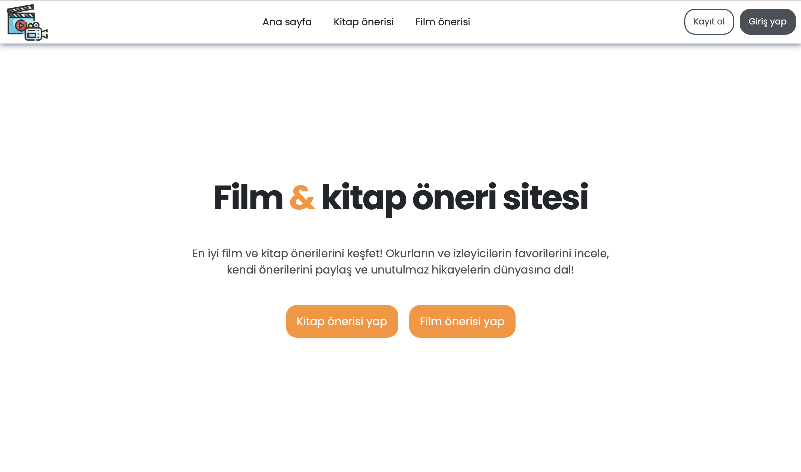
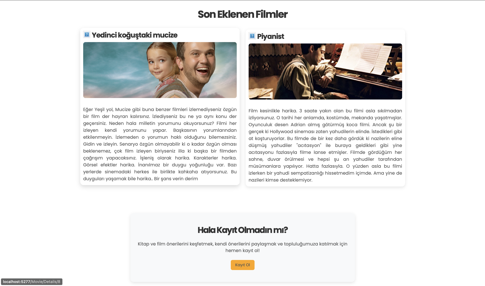
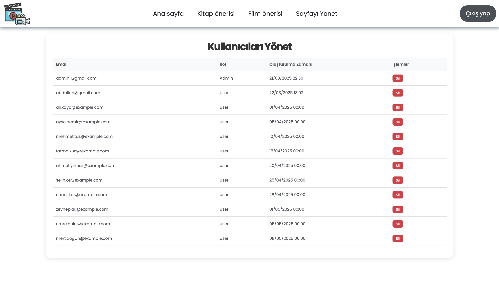
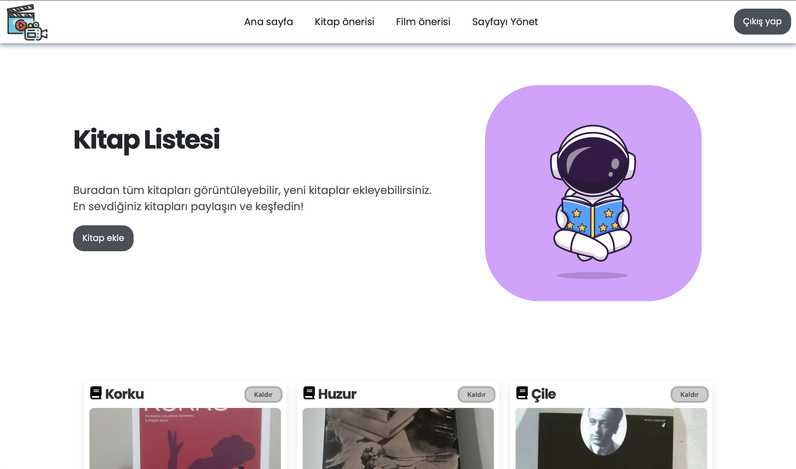
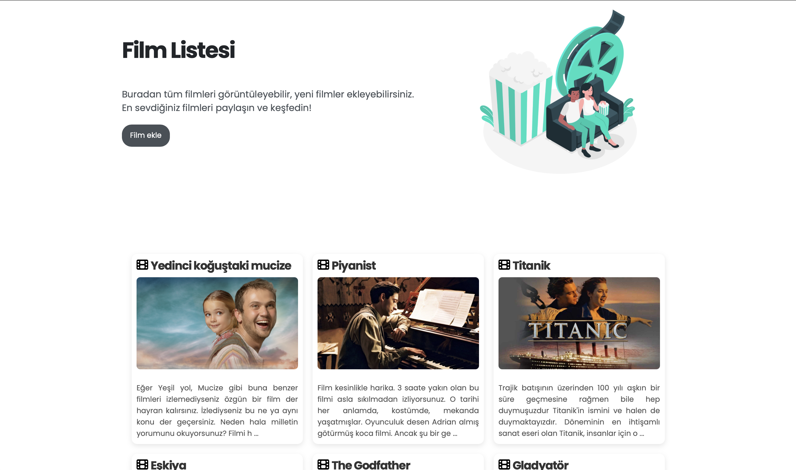
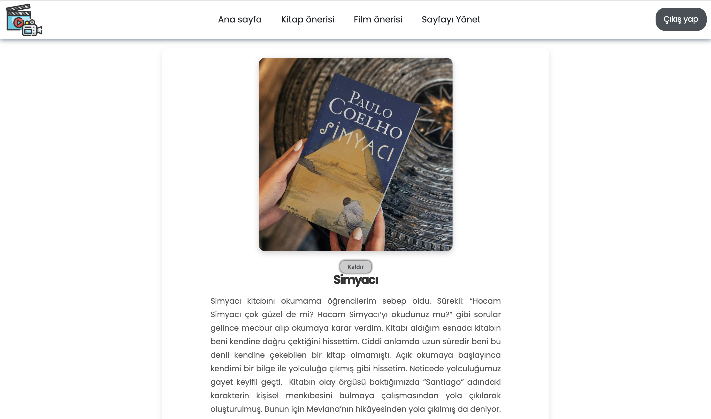
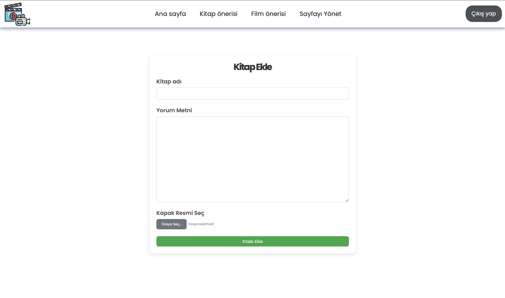

# Film ve Kitap Öneri Sitesi

Bu proje, **ASP.NET MVC** mimarisini öğrenmek amacıyla geliştirilmiş basit bir **film ve kitap öneri platformudur**.

## 🎯 Amaç

Projenin temel amacı, MVC şablonunun nasıl çalıştığını öğrenmek ve kullanıcı yönetimi ile veri tabanı işlemlerini pratiğe dökmektir. Bu projede özellikle:

- Kullanıcı kayıt/giriş sistemini,
- Admin paneli üzerinden temel yönetim işlemlerini,
- SQL veritabanı kullanımı ve CRUD işlemlerini,
- View, Controller ve Model katmanlarının entegrasyonunu

öğrenmek hedeflenmiştir.

## 🔧 Özellikler

- 📚 Kullanıcılar film ve kitap önerisinde bulunabilir.
- 👀 Önerilen içerikler diğer kullanıcılar tarafından görüntülenebilir.
- 🔐 Giriş ve kayıt sistemi (kullanıcı kimlik doğrulama).
- 🛠️ Basit admin paneli:
  - Kullanıcıları silme
  - Gönderileri kaldırma
- 💾 SQL Server kullanılarak geliştirilmiş veritabanı yapısı.

## 🧱 Teknolojiler

- ASP.NET MVC 5
- C#
- SQL Server
- Entity Framework
- HTML/CSS

## ⚠️ Not

Bu proje eğitim amaçlı geliştirilmiştir. Literatürde benzerlerinden daha kapsamlı çözümler bulunabilir. Ancak bu proje temel MVC yapısını anlamak ve gerçek bir senaryo üzerinden ilerlemek isteyenler için örnek teşkil edebilir.

---

## English Version 🇬🇧

# Film and Book Recommendation Website

This is a simple **movie and book recommendation platform** built to learn the **ASP.NET MVC** architecture.

## 🎯 Purpose

The main goal of the project is to understand the MVC structure and practice user management and database operations. This project specifically aims to teach:

- User registration and login system
- Basic admin panel functionalities
- SQL database operations and CRUD
- Integration of View, Controller, and Model layers

## 🔧 Features

- 📚 Users can share movie and book recommendations
- 👀 Shared content can be viewed by others
- 🔐 Authentication system for users
- 🛠️ Simple admin panel:
  - Delete users
  - Remove posts
- 💾 SQL Server database backend

## 🧱 Technologies

- ASP.NET MVC 5
- C#
- SQL Server
- Entity Framework
- HTML/CSS

## ⚠️ Note

This project was developed for educational purposes. There are more advanced examples in the literature, but this project serves as a beginner-friendly demonstration of the MVC pattern in a real-world scenario.

---

**Developer:** Abdullah Hakkaya

## 🖼️ Screenshots

<table>
  <tr>
    <td align="center">
      <strong>Homepage</strong> 
      
    </td>
    <td align="center">
      <strong>Homepage</strong> 
      
    </td>
  </tr>
  <tr>
    <td align="center">
      <strong>Admin Panel</strong> 
      
    </td>
    <td align="center">
      <strong>Login Page</strong> 
      
    </td>
  </tr>
  <tr>
    <td align="center">
      <strong>Books Page</strong> 
      
    </td>
    <td align="center">
      <strong>Movies Page</strong> 
      
    </td>
  </tr>
  <tr>
    <td align="center">
      <strong>Book Details Page</strong> 
      
    </td>
    <td align="center">
      <strong>Book Adding Page</strong> 
      
    </td>
  </tr>
</table>
